# OpenShift Airgap Architect

A local-first wizard that generates OpenShift disconnected (air-gapped) installation assets. It runs entirely on your machine using Docker or Podman—no data is sent to external services except when you explicitly trigger operator discovery or release-channel updates.

## What it is

OpenShift Airgap Architect guides you through scenario-based configuration (Bare Metal Agent-Based, Bare Metal IPI/UPI, VMware vSphere, AWS GovCloud, Azure Government, Nutanix) and produces:

- **install-config.yaml** — Installer input for your chosen platform
- **agent-config.yaml** — For Bare Metal + Agent-Based Installer only
- **imageset-config.yaml** — oc-mirror v2 format for mirroring release and operator content
- **FIELD_MANUAL.md** — A compartmentalized, scenario-specific field guide with numbered, actionable sections drawn from OCP 4.17–4.20 documentation, tailored to your exact configuration (platform, connectivity, FIPS, proxy, NTP, mirroring, operators, and specific values like cluster name, VIPs, and registry FQDN). Each section cites official Red Hat doc sources.
- **NTP MachineConfigs** — When NTP servers are set (e.g. `99-chrony-ntp-master.yaml`, `99-chrony-ntp-worker.yaml`)

The app uses official OpenShift 4.17–4.20 parameter catalogs and aligns generated YAML with the docs for the selected version.

## Who it's for

- Platform engineers and SREs planning disconnected or restricted-network OpenShift installs
- Anyone who wants a single place to configure cluster identity, networking, mirroring, trust bundles, and platform-specific settings before running the installer or oc-mirror
- Teams that need repeatable, documented config generation without storing credentials in the app

## Key features

- **Scenario-driven UI** — Pick install method (e.g. Agent-Based, vSphere IPI); the wizard shows only relevant steps and fields
- **Version-aware** — Cincinnati channels and patch selection; generated assets match the chosen OCP version (4.17–4.20)
- **Credentials-safe** — Pull secrets and BMC/vCenter-style credentials are not persisted by default; optional export with explicit inclusion. Helpers generate pull secrets and SSH keypairs locally and are not stored (see [Identity & Access](#screenshots) and [Mirror secret helper](#screenshots)).
- **Operator discovery** — Optional scan of certified/community/Red Hat operators via `oc-mirror list operators` (requires registry.redhat.io auth)
- **Trust and proxy** — additionalTrustBundle and proxy settings with version-appropriate policy (e.g. Proxyonly / Always)
- **Run oc-mirror** — Built-in tab to run oc-mirror v2 directly from the app (mirror-to-disk, disk-to-mirror, mirror-to-mirror workflows; per-run credentials; preflight checks; live job streaming to Operations)
- **Dark mode** — Toggle between light and dark themes from the Tools menu; all UI elements honor the selected theme
- **Export options** — Choose whether to include credentials, certificates, client tools, and openshift-install in the run bundle

## Quick start (container)

**Docker:**

```bash
docker compose up --build
```

**Podman:** Use **`podman compose`** (Compose V2), the same `docker-compose.yml` (one file for both Docker and Podman); so build and run use the same daemon and you avoid "image not known" after build:

```bash
podman compose up --build
```

If your system only has `podman-compose` (Python), use that; the project does not ship a separate `podman-compose.yml`.

Then open the UI at **http://localhost:5173** (ports are bound to localhost by default; see [Container run](#container-run) to change that).

### Rebuild and restart (preserving data)

The command flow to cleanly rebuild and restart the stack while keeping all existing state:

```bash
# Podman
podman compose down --remove-orphans && podman image prune -f && podman compose up --build -d

# Docker
docker compose down --remove-orphans && docker image prune -f && docker compose up --build -d
```

The `backend-data` named volume is preserved unless you explicitly pass `-v` to `compose down`. All app state (wizard configuration, job history) lives in that volume.

### SELinux (Podman on Fedora/RHEL)

If you mount files or folders with Podman, add `:Z` or `:z` to volume mounts as needed.

## Local development

- **Backend:** `cd backend && npm install && npm run dev` (or start via your IDE). Set `DATA_DIR` if you want state outside `./data` (e.g. `backend/data`).
- **Frontend:** `cd frontend && npm install && npm run dev`. Vite serves the UI; point it at the backend (default `http://localhost:4000` via `VITE_API_BASE`).
- **Tests:** `npm test` in `backend/` and `frontend/`. See `docs/CONTRIBUTING.md` for contribution and test conventions.

The backend uses SQLite for state and job history; the frontend uses React + Vite.

## Running without Compose

If you prefer not to use Docker Compose or Podman Compose, you can run the frontend and backend yourself on the host.

1. **Backend** (Node 20+):
   ```bash
   cd backend && npm install && npm run dev
   ```
   The API listens on `http://localhost:4000` by default. Set `DATA_DIR` if you want state in a specific directory (e.g. `./data`).

2. **Frontend** (Node 20+):
   ```bash
   cd frontend && npm install && npm run dev
   ```
   Set `VITE_API_BASE=http://localhost:4000` if your backend is elsewhere. The UI is served at `http://localhost:5173`.

3. Open **http://localhost:5173** in a browser. The frontend will call the backend at the URL configured by `VITE_API_BASE`.

Operator scan and bundle generation (including oc/oc-mirror binaries) require the same backend environment (Node, oc-mirror resolution, `DATA_DIR`) as when run via Compose; only the process manager differs.

## Container run

The stack is two services (frontend, backend). Ports in `docker-compose.yml` are bound to **127.0.0.1** by default so the app is not exposed on the LAN. To allow access from other machines, change the left side of the port mapping to `0.0.0.0` (e.g. `"0.0.0.0:5173:5173"`).

- **Frontend:** 5173 (Vite dev server in container; binds to `0.0.0.0` inside the container via `--host 0.0.0.0`)
- **Backend:** 4000 (Express API)
- **State:** Backend uses a named volume for SQLite; run bundles and temp files are under that data path.

### Container images and security (UBI, non-root)

Both containers use **Red Hat UBI 9** images and run the application **non-root** where possible:

- **Frontend:** UBI 9 Node.js 20; app runs as UID 1001. No writable volume; no root needed.
- **Backend:** UBI 9 Node.js 20; the **Node process runs as UID 1001** (user `appuser` in the image). The mounted data volume (`/data`) must be writable by that user. The backend image uses an **entrypoint script** that:
  1. Runs initially as root (only to fix volume permissions).
  2. Runs `chown -R 1001:0` on `DATA_DIR` (default `/data`) so the volume is writable by the app user.
  3. Drops to UID 1001 via `runuser` and starts the Node server.

So the backend does **not** run the application as root; root is used only briefly at container start to set ownership on the mounted volume. If the volume is already writable by 1001 (e.g. first run after a clean volume, or a volume you pre-created with the right ownership), the chown is a no-op and the process still drops to 1001. This matches common practice for secure container workloads. The image installs `util-linux` (for `runuser`) and creates a system user `appuser` with UID 1001 so the drop works correctly. See `backend/scripts/entrypoint.sh` and `docs/POST_UBI_VERIFICATION.md` for details and troubleshooting.

### Same-host vs remote access

- **Same-host:** Using the app on the same machine where Compose runs: leave `VITE_API_BASE` as `http://localhost:4000`. The frontend is built with this URL, so the browser (on the same host) can reach the backend at localhost:4000.
- **Remote access:** To use the UI from another machine (e.g. laptop to dev server), (1) expose ports on the host by changing port mappings to `0.0.0.0:5173:5173` and `0.0.0.0:4000:4000`, and (2) set `VITE_API_BASE` to the URL where the backend is reachable from the **client** browser (e.g. `http://<host-ip-or-name>:4000`). The frontend container reads this at startup; if you keep `VITE_API_BASE=http://localhost:4000`, API calls from a remote browser will go to the client's localhost and fail. Override the env when starting the stack (e.g. `VITE_API_BASE=http://192.168.1.10:4000 docker compose up`) or in a compose override file.

### Running behind a reverse proxy or OpenShift Route

When users reach the app through a **different hostname** than the one the frontend container uses internally (for example an OpenShift Route like `https://airgap-architect.example.com`, or an nginx/HAProxy hostname), the Vite dev server will block requests unless that hostname is explicitly allowed.

**Why this happens:** The browser sends the external hostname in the HTTP `Host` header. Vite only accepts a limited set of hosts by default (e.g. `localhost`) to reduce certain security risks. Any other host is rejected with a message like: *"Blocked request. This host ("airgap-architect.example.com") is not allowed."*

**What you need to do:**

1. **Set `VITE_ALLOWED_HOSTS`** to the exact hostname (or hostnames) that users type in the browser.
   - **One host:** `VITE_ALLOWED_HOSTS=airgap-architect.example.com`
   - **Several hosts:** Comma-separated, no spaces: `VITE_ALLOWED_HOSTS=app.example.com,airgap-architect.example.com`
   - Use the same value that appears in the browser's address bar (including subdomain). Do not include `https://` or a path—only the hostname.

2. **Where to set it** depends on how you run the app:
   - **Docker Compose / Podman Compose:** Add to the `frontend` service in `docker-compose.yml` under `environment`, or pass it when starting:
     `VITE_ALLOWED_HOSTS=airgap-architect.example.com docker compose up --build`
   - **OpenShift (Deployment, DeploymentConfig, etc.):** Add an environment variable to the **frontend** container spec:
     - **Name:** `VITE_ALLOWED_HOSTS`
     - **Value:** The hostname of your Route (e.g. `airgap-architect.cjmays.com`). You can find it in the OpenShift console under **Networking → Routes** for your app, or in the Route's **Host** field.
   - **Kubernetes:** Set `VITE_ALLOWED_HOSTS` in the frontend Pod/Deployment's env (e.g. `env` or `envFrom`).
   - **Local dev (npm run dev):** Export before starting, e.g.
     `export VITE_ALLOWED_HOSTS=my-app.mycompany.com` then `npm run dev`, or pass inline: `VITE_ALLOWED_HOSTS=my-app.mycompany.com npm run dev`.

3. **If the UI still can't reach the backend**, you are likely using a reverse proxy or Route for the **frontend** only. The browser then needs to call the backend at a URL it can reach (often the same host with a path, or a separate backend host). Set **`VITE_API_BASE`** to that URL (e.g. `https://airgap-architect.example.com/api` if your proxy forwards `/api` to the backend, or `https://airgap-architect-backend.example.com` if the backend has its own hostname). The frontend container reads both `VITE_ALLOWED_HOSTS` and `VITE_API_BASE` at startup; rebuild or restart the frontend after changing them.

4. **Security note:** Only add hostnames you control and that users are supposed to use. Leaving `VITE_ALLOWED_HOSTS` unset is safe for local use (localhost remains allowed). For production-like deployments behind a proxy or Route, setting it to your actual hostname(s) is the intended approach.

## Updating the app

When the Landing page or **Tools → About** shows that an update is available, follow **[docs/UPDATING.md](docs/UPDATING.md)** for your deployment. Build info and update checks depend on how the image was built (see [Build info and update checks](#build-info-and-update-checks)); builds from a git clone get real SHA/time; builds from a tarball without `.git` show "unknown" and cannot report update availability.

## Generating assets

1. Complete the wizard (Blueprint → Methodology → scenario steps → Operators if desired → Assets & Guide).
2. On the **Assets & Guide** step, use **Export** to download a run bundle (ZIP) containing generated YAML and the field manual. Export options control inclusion of credentials, certificates, and client tools.
3. **install-config.yaml** and **agent-config.yaml** (when applicable) are also available as inline copy/download from the same step.
4. Use **Update Docs Links** to refresh cached documentation links used in the field manual.

## Operator workflows

- **Operator scan** uses `oc-mirror list operators` and requires valid **registry.redhat.io** credentials.
- **Recommended:** Mount an auth file into the backend and set `REGISTRY_AUTH_FILE`:

  ```bash
  REGISTRY_AUTH_FILE=/data/registry-auth.json docker compose up --build
  ```

  To mount a local file, add a volume in `docker-compose.yml`, e.g.:

  ```yaml
  backend:
    volumes:
      - ./my-pull-secret.json:/data/registry-auth.json:Z
  ```

- **Optional:** In the Operators step you can paste a Red Hat pull secret; it is used only for the scan, not stored, and is cleared on **Start Over**.
- Scans can take several minutes; navigation does not cancel running jobs. Use the Operations step to view logs and clear completed jobs.
- If an `oc-mirror` run is active and you click **Start Over**, the confirmation modal warns you and lists relevant paths. Continuing cancels the active `oc-mirror` run safely (non-destructive) and returns to Landing; review those paths for partial artifacts before re-running.

## Run oc-mirror

The **Run oc-mirror** tab lets you run oc-mirror v2 directly from the app against the generated (or an external) `imageset-config.yaml`. oc-mirror runs as a background job inside the backend container. You can stream its output and manage the job from the Operations tab.

### Workflows

Three workflows are supported. The correct choice depends on whether the machine running the app has direct internet access to Red Hat registries:

| Workflow | When to use | Steps |
|---|---|---|
| **Step 1 — Mirror to disk** | Fully disconnected: internet side | Pulls from Red Hat → writes tar archives + working-dir to a local path |
| **Step 2 — Disk to mirror** | Fully disconnected: disconnected side | Reads tar archives from a local path → pushes to your mirror registry |
| **Mirror to mirror** | Machine has access to both Red Hat and the registry | Pulls from Red Hat → pushes directly to mirror registry in one step |

For **fully disconnected** environments: run Step 1 on an internet-connected machine, physically transfer the archive directory (and working-dir) across the air gap, then run Step 2 on or near the disconnected registry. Mirror-to-mirror is for jumpbox or partially connected scenarios.

### Credentials per workflow

| Workflow | Credentials needed |
|---|---|
| Mirror to disk | Red Hat pull secret (registry.redhat.io / quay.io) |
| Disk to mirror | Mirror registry credentials only |
| Mirror to mirror | Both Red Hat pull secret + mirror registry credentials (combined into a single auth file) |

The Authentication section on the Run oc-mirror tab is conditionally rendered based on which workflow is selected and what credentials are already available from earlier steps (Blueprint retained pull secret, Identity & Access mirror registry credentials).

### Storage: archive, workspace, and cache paths

oc-mirror requires three directories inside the backend container:

| Path (container-internal) | Default | Purpose | Typical size |
|---|---|---|---|
| **Archive** | `/data/oc-mirror/archives` | Mirror-to-disk: destination for tar archives and working-dir. Disk-to-mirror: source for those archives. | 50–200+ GB per OCP release + operators |
| **Workspace** | `/data/oc-mirror/workspace` | oc-mirror metadata, cluster-resources, logs (`working-dir/`). Keep between runs for incremental mirroring (`--since`). | 1–5 GB |
| **Cache** | `/data/oc-mirror/cache` | Image layer cache. Safe to delete (rebuilds automatically); keeping it saves significant time on re-runs. Not used in mirror-to-mirror mode. | 5–50+ GB |

All three paths live inside the `backend-data` Docker/Podman named volume by default. For large mirrors (50–200+ GB archives), the default named volume likely lacks space. **Mount external storage** instead.

### Mounting external storage for oc-mirror (recommended for large mirrors)

Create a `compose.override.yml` file in the same directory as `docker-compose.yml`. This file is gitignored and will never be committed.

#### Option A — Single path (all three subdirs under one mount)

```yaml
# compose.override.yml
services:
  backend:
    volumes:
      - /path/to/large-drive/oc-mirror:/data/oc-mirror:Z
```

Replace `/path/to/large-drive/oc-mirror` with a host path that has enough space (50–200+ GB minimum for a single OCP release + common operators).

**What happens with the subdirectories:** The app uses three subdirectories under this path — `archives/`, `workspace/`, and `cache/`. **You do not need to create them.** The app creates all three automatically on the first run. You will see them appear in the archive/workspace/cache path fields as `/data/oc-mirror/archives`, `/data/oc-mirror/workspace`, and `/data/oc-mirror/cache` — which map to `<your-host-path>/archives`, `<your-host-path>/workspace`, and `<your-host-path>/cache` on the host. Nothing is dumped directly into the root of the mounted directory.

#### Option B — Split paths (each subdir mounted from a different host location)

Use this if your storage is spread across multiple drives or you want fine-grained control:

```yaml
# compose.override.yml
services:
  backend:
    volumes:
      - /mnt/fast-ssd/oc-mirror/archives:/data/oc-mirror/archives:Z
      - /mnt/fast-ssd/oc-mirror/workspace:/data/oc-mirror/workspace:Z
      - /mnt/fast-ssd/oc-mirror/cache:/data/oc-mirror/cache:Z
```

**With split paths you must pre-create the host directories** before starting the stack, because Compose will error if a bind-mount target doesn't exist on the host:

```bash
mkdir -p /mnt/fast-ssd/oc-mirror/archives
mkdir -p /mnt/fast-ssd/oc-mirror/workspace
mkdir -p /mnt/fast-ssd/oc-mirror/cache
```

> **Do not use `sudo mkdir`** — the directory must be owned by the user who runs `podman compose` / `docker compose`, not by root. See [Permissions and SELinux](#permissions-and-selinux-podman-on-fedorarhelcentos) below.

#### Rebuild and restart after adding the override

```bash
# Podman
podman compose down --remove-orphans && podman image prune -f && podman compose up --build -d

# Docker
docker compose down --remove-orphans && docker image prune -f && docker compose up --build -d
```

The named `backend-data` volume (app state, SQLite database) is **preserved** — only the `oc-mirror` paths are now served from your external mount. Compose merges `docker-compose.yml` and `compose.override.yml` automatically; you do not need to modify `docker-compose.yml` directly.

### Permissions and SELinux (Podman on Fedora/RHEL/CentOS)

**This section applies to you if you are running Podman on a Linux host with SELinux enforcing (Fedora, RHEL, CentOS Stream).** If you skip these steps you will see `EACCES: permission denied` when the app tries to browse or write to the mounted directory.

There are two independent requirements — both must be satisfied:

#### 1. `:Z` volume label (SELinux relabeling — required on Fedora/RHEL/CentOS)

All volume mounts in `compose.override.yml` **must** include `:Z` so Podman relabels the host directory with the correct SELinux context for container access:

```yaml
      - /path/to/large-drive/oc-mirror:/data/oc-mirror:Z
```

Without `:Z`, SELinux blocks the container from reading or writing the directory at the kernel level, even if the file permissions look correct. This is the most common cause of `EACCES: permission denied` on Fedora.

> **Note:** `:Z` (uppercase) sets a private, unshared label — safe for a single container. `:z` (lowercase) sets a shared label for multiple containers. Use `:Z` unless you have a specific reason for `:z`.

#### 2. Directory ownership (must be owned by the user running podman, not root)

Create the host directory as yourself — **not with `sudo`**:

```bash
# Correct — owned by your user
mkdir -p /path/to/large-drive/oc-mirror

# Wrong — owned by root; the container's chown step cannot fix this
sudo mkdir -p /path/to/large-drive/oc-mirror
```

If you already created it with `sudo`, fix it:

```bash
sudo chown $USER /path/to/large-drive/oc-mirror
# or for a split-path setup:
sudo chown $USER /path/to/archives /path/to/workspace /path/to/cache
```

**Why this matters:** The backend container runs the app as UID 1001 (`appuser`). The entrypoint starts as root and attempts `chown -R 1001:0` on the data directory before dropping privileges. With rootless Podman, the container's root maps to your host UID, so it can only chown files your host user owns. If the directory was created with `sudo` (owned by host root), the chown fails silently and UID 1001 cannot access the directory. The entrypoint falls back to `chmod o+rwX` in that case, but `:Z` is still required for SELinux.

#### Quick diagnosis

If you see `EACCES: permission denied` in the Browse directory modal or in oc-mirror run logs:

1. Check that your `compose.override.yml` includes `:Z` on every volume mount.
2. Check that the host directory is owned by your user: `ls -la /path/to/large-drive/`
3. If both look correct, check SELinux context: `ls -laZ /path/to/large-drive/oc-mirror` — it should include `container_file_t` or similar after a `:Z`-mounted start.
4. Rebuild after any change: `podman compose down --remove-orphans && podman compose up --build -d`

### Mounting a Red Hat pull secret for oc-mirror (persistent, no paste required)

If you want oc-mirror to authenticate to Red Hat registries without pasting a pull secret on every run, mount your pull secret JSON and set `REGISTRY_AUTH_FILE`:

```yaml
# compose.override.yml
services:
  backend:
    environment:
      - REGISTRY_AUTH_FILE=/data/registry-auth.json
    volumes:
      - /path/to/your/pull-secret.json:/data/registry-auth.json:Z
      - /path/to/large-drive/oc-mirror:/data/oc-mirror:Z
```

The `REGISTRY_AUTH_FILE` variable is already declared in `docker-compose.yml` pointing at `/data/registry-auth.json`; you only need to mount the file there. This also satisfies the "retain Red Hat pull secret" option in the Blueprint tab — the mounted file is available to both the Operators scan and the Run oc-mirror tab.

Alternatively, on the Blueprint step check **"Retain pull secret for this session"** after entering your Red Hat pull secret. The session-retained secret is then available as a one-click option in the Run oc-mirror Authentication section for the mirror-to-disk and mirror-to-mirror workflows.

### Running oc-mirror without Compose (local / standalone)

If you're running the backend directly (not via Compose), ensure:

1. The backend process has write access to the archive, workspace, and cache directories you configure.
2. Set `DATA_DIR` to a path with sufficient space (or configure paths individually in the Run oc-mirror tab).
3. Any pull secret you need is either mounted at `REGISTRY_AUTH_FILE`, retained from Blueprint, or pasted directly in the Authentication section.

```bash
DATA_DIR=/mnt/large-drive/airgap-data \
REGISTRY_AUTH_FILE=/mnt/large-drive/airgap-data/registry-auth.json \
  cd backend && npm run dev
```

Then configure the archive, workspace, and cache paths in the Run oc-mirror tab to point inside `DATA_DIR` (e.g. `/mnt/large-drive/airgap-data/oc-mirror/archives`).

### After a successful mirror-to-disk run

When the run completes, a summary modal appears automatically showing:
- Elapsed time
- Archive directory path (inside the container)
- Next-step instructions

The archive directory contains tar archives and a `working-dir/` subdirectory. **You must transfer the entire archive directory** (not just the tar files — oc-mirror needs `working-dir/` for disk-to-mirror) to the disconnected side, along with your other deliverables (install-config, agent-config, field manual, cluster-resources).

To find the archive on your host when using Compose with the default named volume:

```bash
# Podman
podman volume inspect openshift-airgap-architect_backend-data

# Docker
docker volume inspect openshift-airgap-architect_backend-data
```

Look for the `Mountpoint` field — that host directory corresponds to `/data` inside the container. The archives will be at `<Mountpoint>/oc-mirror/archives/`.

If you used a `compose.override.yml` mount (recommended for large mirrors), the archives are at the host path you specified directly.

## Mock mode (offline demo)

With no registry access, run with bundled Cincinnati and operator data:

```bash
MOCK_MODE=true docker compose up --build
```

## Platform and architecture (multi-arch / Apple Silicon)

**The backend image builds natively for the host architecture.** `Containerfile` detects `$(uname -m)` at build time and downloads the matching `oc`/`oc-mirror` binaries (x86_64, aarch64, ppc64le, s390x). No `platform: linux/amd64` override is needed — Apple Silicon users get a native aarch64 image that runs without emulation.

- **Supported build architectures:** x86_64 (amd64), aarch64 (arm64), ppc64le, s390x.
- **Custom binary URLs:** Pass `--build-arg OCP_CLIENT_URL=<url>` and/or `--build-arg OCP_MIRROR_URL=<url>` to override the auto-detected download URLs at build time.
- **Runtime override:** Set **`OC_MIRROR_BIN`** to a path or **`OC_MIRROR_URL`** to a download URL to override the baked-in binary at runtime without rebuilding.
- **Mirror path pattern:** `https://mirror.openshift.com/pub/openshift-v4/<arch>/clients/ocp/latest/` — Supported `<arch>`: x86_64, amd64, aarch64, arm64, ppc64le, s390x.
- **Export bundle:** The Assets step can include oc/oc-mirror in the download bundle; you can select which architecture to include (default: reuse the backend's local binaries when the selected arch matches). That selection does not change the backend's Operators scan binary.

See **`docs/OPERATOR_SCAN_ARCHITECTURE_PLAN.md`** for root cause, design, and Podman/macOS notes.

## Mounted Red Hat pull secret

In pipeline or hardened-container environments you can pre-mount a Red Hat pull secret file into the backend container instead of pasting it in the UI each session.

**Detection priority (first match wins):**
1. `PULL_SECRET_FILE` env var — explicit path override
2. `/run/secrets/pull-secret` — Docker/Podman native `--secret` mount
3. `/data/pull-secret.json` — bind-mount into the data directory
4. `~/.openshift/pull-secret` — `oc` CLI default location (non-container dev runs)

The file must be valid JSON with an `.auths` key containing at least one Red Hat registry entry (`registry.redhat.io`, `quay.io`, `cloud.openshift.com`, or `registry.connect.redhat.com`).

When a mounted secret is detected:
- **Blueprint step** — the pull secret field is pre-populated automatically (you can override or clear it).
- **Run oc-mirror step** — a "Use mounted Red Hat pull secret" option appears in the Authentication section for `mirrorToDisk` and `mirrorToMirror` modes.
- The secret is **never stored to disk or database** — it is held in memory only for the lifetime of the backend process.

**Example `compose.override.yml`** to mount a pull secret:
```yaml
services:
  backend:
    environment:
      - PULL_SECRET_FILE=/run/secrets/pull-secret
    secrets:
      - pull-secret
secrets:
  pull-secret:
    file: /home/user/pull-secret.json
```

## Build info and update checks

The **Tools → About** panel shows build info (Git SHA, build time, repo, branch) and update status. The backend exposes:

- **`GET /api/build-info`** — Returns `gitSha`, `buildTime`, `repo`, `branch` from env (no git at runtime).
- **`GET /api/update-info`** — When update checks are enabled, compares `APP_GIT_SHA` to the latest commit on the configured branch and returns `enabled`, `isOutdated`, `currentSha`, `latestSha`, `checkedAt`, `error`, etc. Cached (success ~6h, failure ~15min). Set **`CHECK_UPDATES=false`** (or `0`) to disable.

**Env vars (backend):**

| Variable | Description | Default |
|----------|-------------|---------|
| `APP_GIT_SHA` | Git commit SHA of the running build (short or full). | `unknown` |
| `APP_BUILD_TIME` | Build timestamp (e.g. ISO or human-readable). | `unknown` |
| `APP_REPO` | GitHub repo for update check (e.g. `owner/repo`). | `bstrauss84/openshift-airgap-architect` |
| `APP_BRANCH` | Branch to compare against (e.g. `main`). | `main` |
| `CHECK_UPDATES` | Set to `false` or `0` to disable update checks. | enabled |

**Wiring examples:**

- **Podman Compose / Docker Compose:** The backend image computes **APP_GIT_SHA** and **APP_BUILD_TIME** from **.git** during the image build (see `backend/Containerfile`). Run **`podman compose up --build`** from a **git clone** (with `.git` present) and Tools → About will show the current commit and build time. **If you build from a tarball or snapshot that has no `.git` directory**, the image cannot determine build SHA or time, so Tools → About will show "Build unknown • unknown • main" and update availability cannot be determined (update check will show as unavailable). That is expected behavior, not a bug. For `docker run` / OpenShift without building from a clone, see **`scripts/set-build-env.sh`** to pass build args.

- **Docker / Podman run:** Pass at start:
  ```bash
  docker run -e APP_GIT_SHA=abc1234 -e APP_BUILD_TIME="2025-03-03 12:00" -e APP_REPO=bstrauss84/openshift-airgap-architect -e APP_BRANCH=main ...
  ```

- **OpenShift Deployment:** Add to the backend container spec:
  ```yaml
  env:
    - name: APP_REPO
      value: "bstrauss84/openshift-airgap-architect"
    - name: APP_BRANCH
      value: "main"
    - name: APP_GIT_SHA
      valueFrom:
        fieldRef:
          fieldPath: metadata.annotations['openshift.io/git-commit']
    # Or a fixed value / build-time substitution
    - name: APP_BUILD_TIME
      value: "2025-03-03"
  ```

**Git clone vs tarball:** Builds from a normal **git clone** (with `.git`) get real build SHA and time; Tools → About and update checks work as intended. Builds from a **tarball or archive without `.git`** get "unknown" build info and cannot determine update availability; that is expected. No git commands are run by the backend at runtime. For **docker run** or **OpenShift**, set **APP_GIT_SHA** and **APP_BUILD_TIME** at container start; optional helper **`scripts/set-build-env.sh`** prints `export` lines you can source or put in a `.env` file.

## Troubleshooting

- **"Blocked request. This host ("…") is not allowed"** — You are running the Vite dev server (e.g. in a container or locally) and opening the app using a hostname that Vite does not allow by default (for example an OpenShift Route hostname like `airgap-architect.cjmays.com`). Set the environment variable **`VITE_ALLOWED_HOSTS`** to that hostname so the dev server accepts the request. Example: `VITE_ALLOWED_HOSTS=airgap-architect.cjmays.com`. For multiple hostnames, use a comma-separated list with no spaces. See [Running behind a reverse proxy or OpenShift Route](#running-behind-a-reverse-proxy-or-openshift-route) for where to set it (Compose, OpenShift, Kubernetes, or local dev) and how to confirm the correct hostname.
- **"additional properties 'platform' not allowed"** — You're using the Python **`docker-compose`** with an old schema. Prefer **`podman compose`** so Podman doesn't delegate to `/usr/local/bin/docker-compose`; see [Quick start](#quick-start-container). On macOS, see also the compose-provider workaround in `docs/OPERATOR_SCAN_ARCHITECTURE_PLAN.md` or CONTRIBUTING.
- **"no such image" or "image not known" after build (Podman)** — Use **`podman compose`** for the whole workflow. If it still happens, try a clean rebuild: `podman compose down`, `podman rmi localhost/openshift-airgap-architect-backend:latest` (if it exists), then `podman compose up --build`.
- **Port already in use** — Change `PORT` (backend) or the host port in `docker-compose.yml` (e.g. 4001:4000, 5174:5173).
- **Operator scan fails** — Ensure registry.redhat.io credentials are valid and mounted (or pasted in UI for that session). If the job fails with a message about the binary not running, the backend runtime architecture may not have a usable oc-mirror (e.g. Apple Silicon: use native aarch64 binary or set **OC_MIRROR_BIN** / **OC_MIRROR_URL**). See **Platform and architecture** above and `docs/OPERATOR_SCAN_ARCHITECTURE_PLAN.md`.
- **oc-mirror run fails with auth error** — Ensure the correct credentials are provided for the selected workflow. Mirror-to-disk needs a Red Hat pull secret (registry.redhat.io / quay.io); disk-to-mirror needs mirror registry credentials; mirror-to-mirror needs both. If using `REGISTRY_AUTH_FILE`, verify the file is mounted and accessible inside the container.
- **"EACCES: permission denied" in Browse directory or run logs** — Two causes on Fedora/RHEL/CentOS: (1) missing `:Z` SELinux label on the volume mount in `compose.override.yml` — add `:Z` to every bind-mount line and rebuild; (2) host directory created with `sudo` (owned by root) — fix with `sudo chown $USER /your/path`. See [Permissions and SELinux](#permissions-and-selinux-podman-on-fedorarhelcentos) for full details.
- **oc-mirror archives not found on host** — If using the default named volume, use `podman volume inspect openshift-airgap-architect_backend-data` (or `docker volume inspect`) to find the volume mountpoint on the host. For large mirrors, use `compose.override.yml` to bind-mount a host path instead; see [Mounting external storage for oc-mirror](#mounting-external-storage-for-oc-mirror-recommended-for-large-mirrors).
- **Cincinnati or docs stale** — Use **Update** (release channels) or **Update Docs Links** (field manual links) in the UI; the backend refreshes caches on demand.
- **Validation errors on a step** — Required fields are marked; check Identity & Access (pull secret, SSH key), Networking (CIDRs), and Platform Specifics for your scenario.
- **SELinux denials (Podman)** — Use `:Z` on volume mounts or adjust context as needed for your host.

## Screenshots

The wizard walks through Blueprint → Methodology → scenario-specific steps → Operators (optional) → Assets & Guide. Below are key screens in order.

**Landing — Choose workflow.** Install (net-new disconnected), Upgrade (coming soon), or Operator mirroring (coming soon).


**Blueprint — Foundational choices.** Target platform, CPU architecture, OpenShift release (channel + patch), and Red Hat pull secret. Check "Retain pull secret for this session" to make it available for operator scan and Run oc-mirror without re-pasting.


**Methodology — Scenario summary and installer type.** After lock-in, the scenario summary shows what will be generated; you pick IPI, UPI, or Agent-Based Installer.

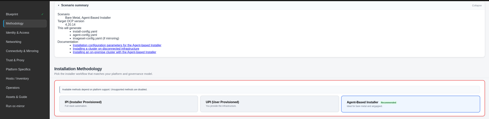

**Identity & Access — Cluster identity and credentials.** Base domain, cluster name, mirror registry pull secret (paste/upload or generate via helper), SSH key (paste or generate keypair), and FIPS mode. Credentials are not stored by default.

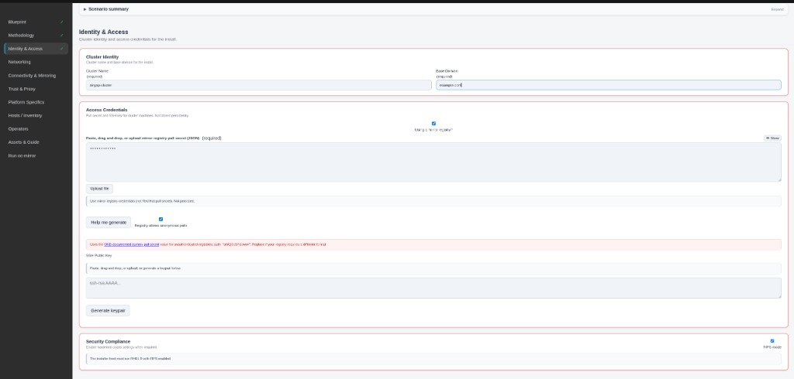

**Mirror registry pull secret helper.** Generates pull secret JSON locally from registry FQDN and credentials; not stored or exported.

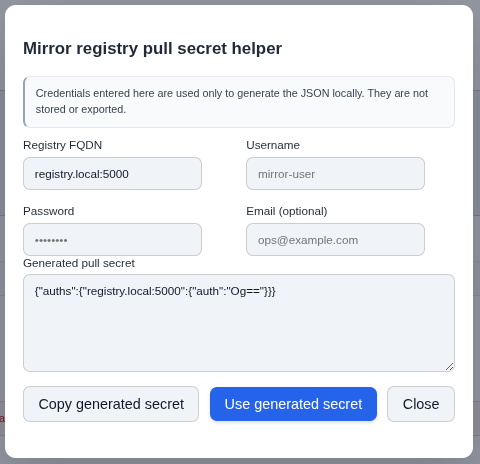

**SSH keypair helper.** Generate a keypair locally; the app reminds you to save the private key — it is not stored.

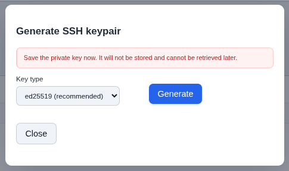

**Networking — Machine, cluster, and service CIDRs.** IPv4 by default; enable IPv6 for dual-stack and optional cluster/service IPv6 fields.

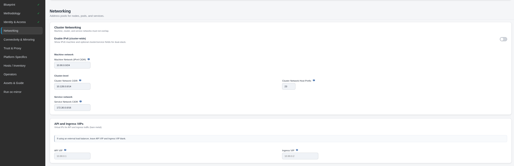

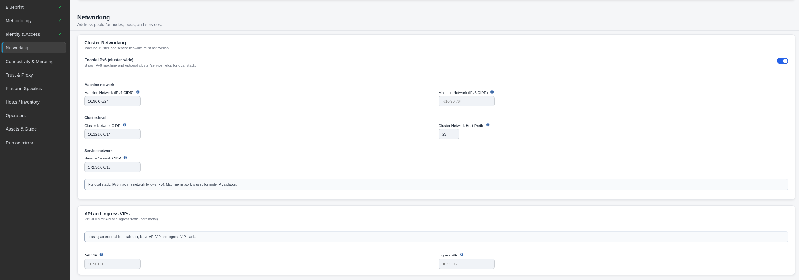

**Connectivity & Mirroring — Local registry and NTP.** Mirror mapping (source → mirror paths) and NTP servers for install-config and agent-config.

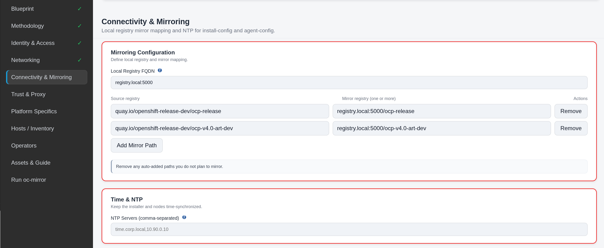

**Trust & Proxy — Corporate proxy and CA bundles.** Optional proxy (HTTP/HTTPS/noProxy); mirror and proxy CA bundles; trust bundle policy (Proxyonly / Always).

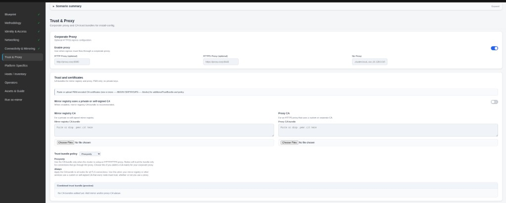

**Platform Specifics — Advanced options.** Boot artifact URI, hyperthreading, capabilities, CPU partitioning, minimal ISO, and other scenario-specific options.

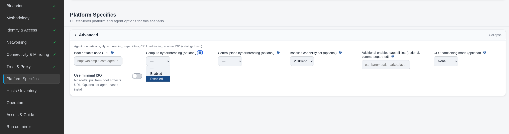

**Platform Specifics — vSphere IPI.** The step changes by scenario; for vSphere IPI it shows vCenter server, datacenter, datastore, optional compute cluster and VM network, failure domains, and credentials.

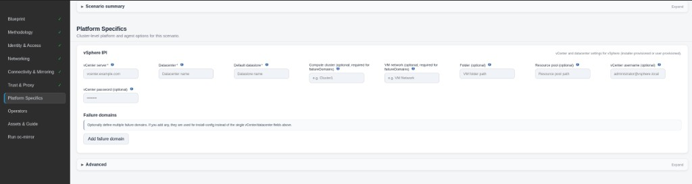

**Hosts / Inventory — Bare metal nodes (Agent-Based).** Instructions to gather host info (interfaces, disks), then set node counts and edit each host (role, root device, network, bond/VLAN). You can apply settings from one node to others.

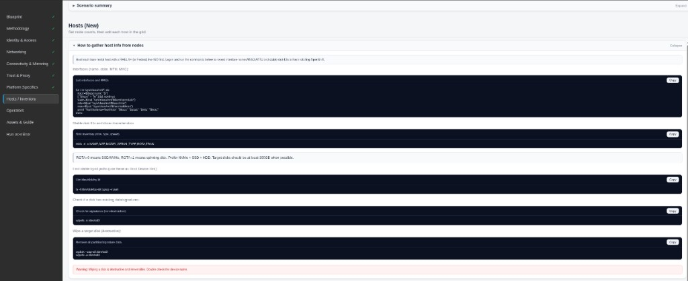

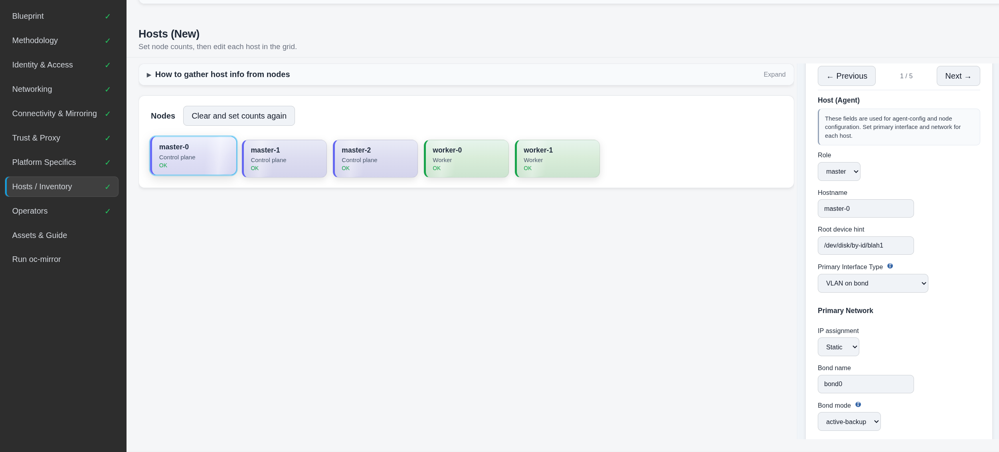

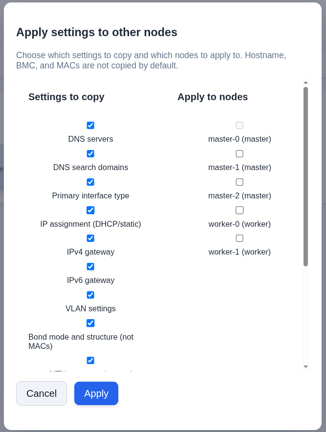

**Operators — Catalog strategy and discovery.** Scenario Quick Picks (e.g. Virtualization, GitOps), selected operators, and available catalogs. Enable discovery and run Scan / Update Operators to populate from registry.redhat.io.

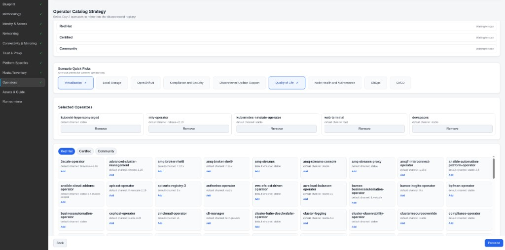

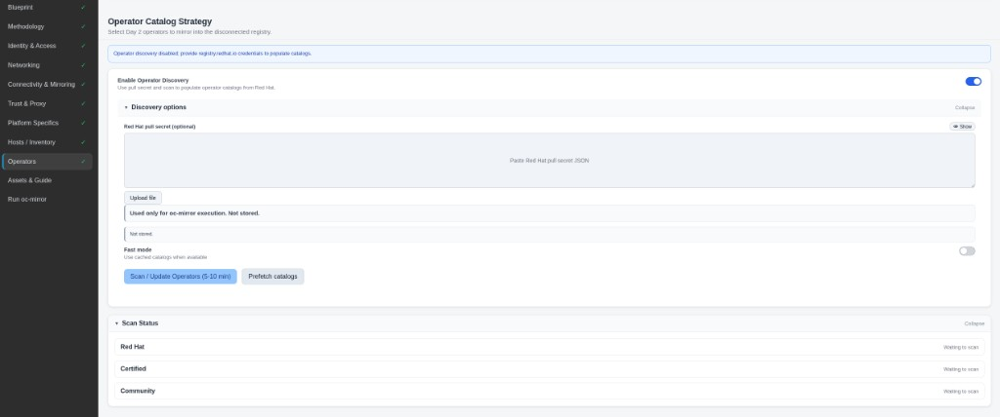

**Assets & Guide — Export and previews.** Export options (credentials, certificates, oc/oc-mirror, openshift-install), architecture choice for bundle binaries, and previews of install-config.yaml, agent-config.yaml, imageset-config.yaml, and the Field Manual.

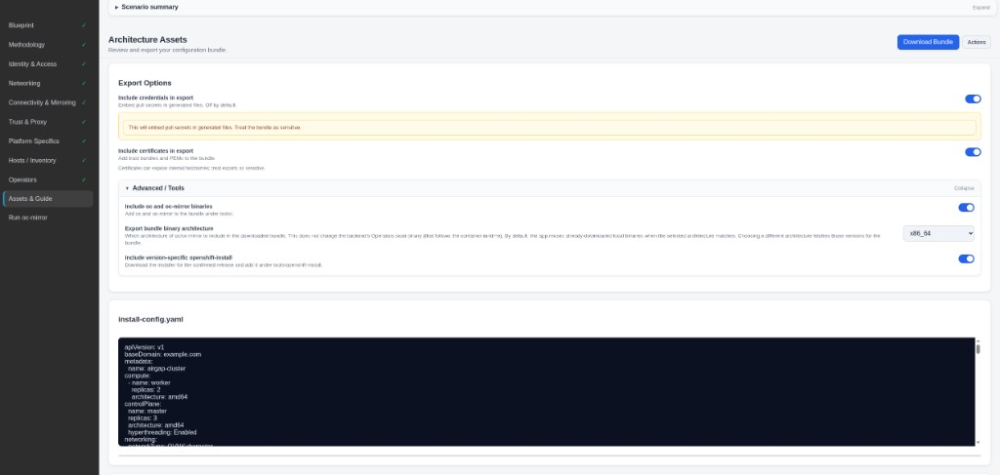

**imageset-config.yaml** (generated for mirroring): platform channel/version and operator packages/channels.

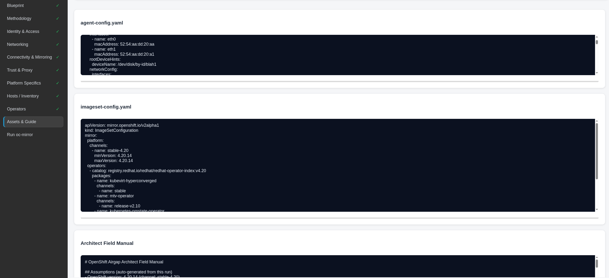

**Tools menu.** Theme (light/dark mode toggle), Export Run / Import Run, Open Operations (background jobs), and Start Over.

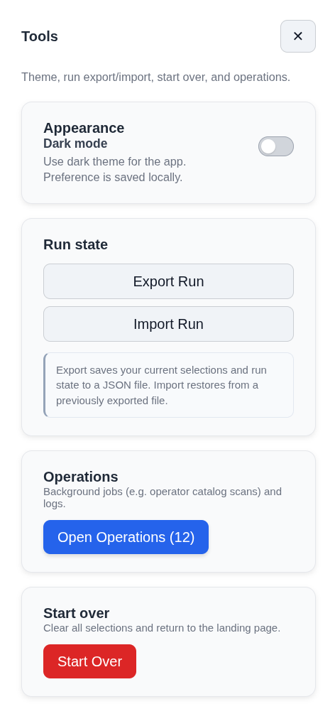

## Architecture

- **Frontend:** React, Vite, PatternFly-derived styling. Container image: Red Hat UBI 9 Node.js 20.
- **Backend:** Node.js, Express, SQLite (state and job history). Container image: Red Hat UBI 9 Node.js 20; runs as non-root (UID 1001) via entrypoint that chowns the data volume then drops to `appuser`; build-info stage uses UBI 9 minimal. oc/oc-mirror are installed in-image from the OpenShift mirror.
- **Data:** Parameter catalogs and doc index under `data/params` and `data/docs-index`; frontend copies under `frontend/src/data` for the build. See `docs/DATA_AND_FRONTEND_COPIES.md`.

## Install-config references (4.20)

Use these official docs to validate `install-config.yaml` for supported platforms:

- [AWS GovCloud](https://docs.redhat.com/en/documentation/openshift_container_platform/4.20/html/installing_on_aws/installation-config-parameters-aws)
- [Azure Government](https://docs.redhat.com/en/documentation/openshift_container_platform/4.20/html/installing_on_azure/installation-config-parameters-azure)
- [VMware vSphere](https://docs.redhat.com/en/documentation/openshift_container_platform/4.20/html/installing_on_vmware_vsphere/installation-config-parameters-vsphere)
- [Nutanix](https://docs.redhat.com/en/documentation/openshift_container_platform/4.20/html/installing_on_nutanix/installation-config-parameters-nutanix)
- [Agent-based Installer](https://docs.redhat.com/en/documentation/openshift_container_platform/4.20/html/installing_an_on-premise_cluster_with_the_agent-based_installer/installation-config-parameters-agent)

Notes: `credentialsMode` and `publish` apply to cloud (AWS/Azure). For vSphere, Nutanix, and bare metal agent-based installs, see the platform-specific docs for required and optional fields.

## License and contributing

See the repository license file. Contributions are welcome; please read `docs/CONTRIBUTING.md` and `docs/CODE_STYLE_RULES.md` before opening a pull request.

## Documentation and governance map

For canonical process and policy ownership:

- `docs/INDEX.md` — authority map for docs and working artifacts
- `docs/BACKLOG_STATUS.md` — canonical backlog and status registry
- `docs/HELPER_USAGE.md` — helper/agent selection and usage
- `AI_GOVERNANCE.md` — AI-assistance governance and compliance policy
